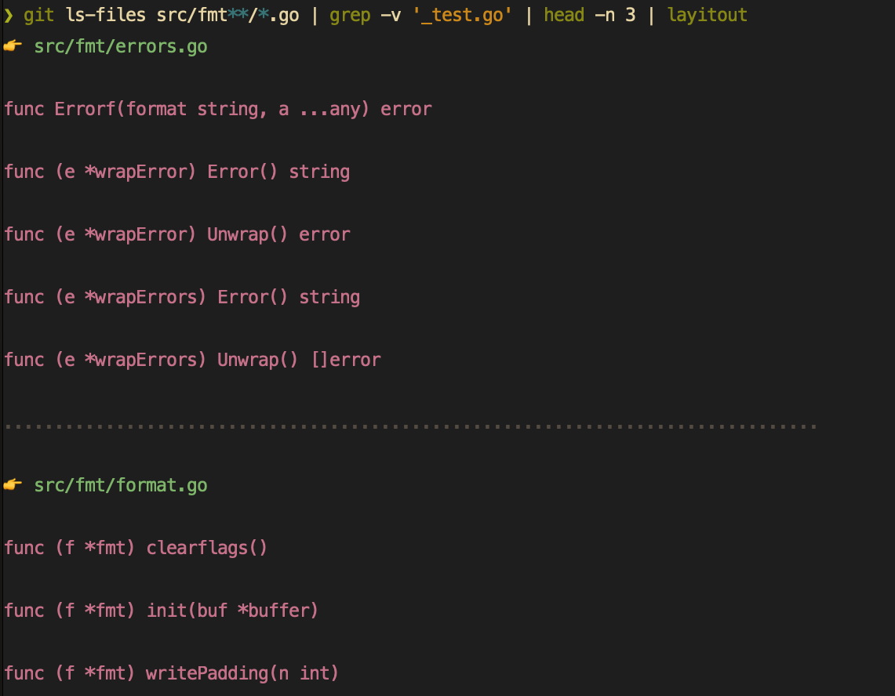

# layitout

✨ Overview
---

`layitout` gives you a high level overview of various constructs in your code
files.



Languages supported:

- go
- scala
- python
- more to come

⚡️ Usage
---

```bash
git ls-files | grep '.*.go$' | layitout
# or
git -C /path/to/project ls-files \
    | grep '.*.scala$' \
    | sed "s|^|/path/to/project/|" \
    | layitout \
        -trim-prefix='/path/to/project/'
```

TODO
---

- go
    - [ ] Query methods
- scala
    - [ ] Query Objects
- python
    - [ ] Query classes
- [ ] JS
- [ ] TS

Examples
---

Running `layitout` in the [go][1] repo gives the following output:

```
# git ls-files | grep '.*.go$' | head -n 10 | layitout

👉 misc/cgo/gmp/gmp.go

func NewInt(x int64) *Int
func CmpInt(x, y *Int) int

................................................................................

👉 misc/cgo/gmp/pi.go

func extractDigit() int64

................................................................................

👉 misc/go_android_exec/main.go

func adbRun(args string) (int, error)
func adb(args ...string) error
func adbCmd(args ...string) *exec.Cmd
func runMain() (int, error)
func newExitCodeFilter(w io.Writer) (*exitCodeFilter, string)
func pkgPath() (importPath string, isStd bool, modPath, modDir string, err error)
func adbCopyTree(deviceCwd, subdir string) error
func adbCopyGoroot() error
func findGoroot() (string, error)
func goTool() (string, error)

................................................................................

👉 misc/ios/detect.go

func detectMobileProvisionFiles(udids [][]byte) []string
func parseMobileProvision(fname string) *exec.Cmd
func plistExtract(fname string, path string) ([]byte, error)
func getLines(cmd *exec.Cmd) [][]byte
func output(cmd *exec.Cmd) []byte

................................................................................

👉 misc/ios/go_ios_exec.go

func runMain() (int, error)
func runOnSimulator(appdir string) error
func runOnDevice(appdir string) error
func getenv(envvar string) string
func assembleApp(appdir, bin string) error
func signApp(appdir string) error
func mountDevImage() error
func findDevImage() (string, error)
func startDebugBridge() (func(), error)
func findDeviceAppPath(bundleID string) (string, error)
func parsePlistDict(dict []byte) (map[string]string, error)
func installSimulator(appdir string) error
func uninstallDevice(bundleID string) error
func installDevice(appdir string) error
func idevCmd(cmd *exec.Cmd) *exec.Cmd
func runSimulator(appdir, bundleID string, args []string) error
func runDevice(appdir, bundleID string, args []string) error
func runLLDB(target, appdir, deviceapp string, args []string) ([]byte, error)
func copyLocalDir(dst, src string) error
func cp(dst, src string) error
func copyLocalData(dstbase string) (pkgpath string, err error)
func subdir() (pkgpath string, underGoRoot bool, err error)
func infoPlist(pkgpath string) string
func entitlementsPlist() string

................................................................................

👉 misc/linkcheck/linkcheck.go

func localLinks(body string) (links []string)
func pageIDs(body string) (ids []string)
func doCrawl(url string) error

................................................................................

👉 src/archive/tar/common.go

func validateSparseEntries(sp []sparseEntry, size int64) bool
func alignSparseEntries(src []sparseEntry, size int64) []sparseEntry
func invertSparseEntries(src []sparseEntry, size int64) []sparseEntry
func FileInfoHeader(fi fs.FileInfo, link string) (*Header, error)
func isHeaderOnlyType(flag byte) bool

................................................................................
```

[1]: https://github.com/golang/go
